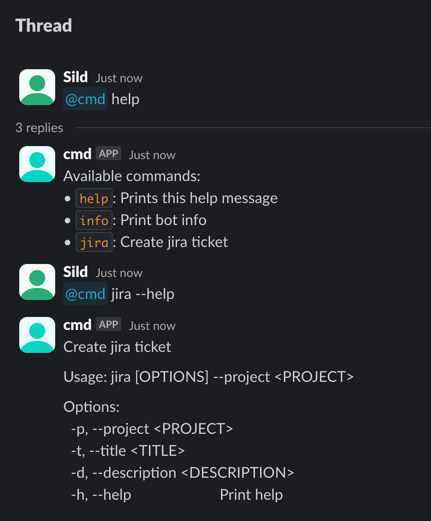

# Slack CMD

Allows to turn slack chat into a command line interface.

## Usage

```rust
#[tokio::main]
async fn main() -> anyhow::Result<()> {
    env_logger::init();
    let oauth_token = env::var("SLACK_CMD_OAUTH_TOKEN")?;
    let socket_token = env::var("SLACK_CMD_SOCKET_TOKEN")?;

    let jira_url = env::var("JIRA_URL")?;
    let jira_user_email = env::var("JIRA_USER_EMAIL")?;
    let jira_token = env::var("JIRA_TOKEN")?;

    let handlers = [
        InfoHandler::make(),
        JiraHandler::make(&jira_url, &jira_user_email, &jira_token, ALL_CHANNELS.iter().cloned()),
    ];

    slack_cmd_core::run(&oauth_token, &socket_token, handlers).await?;
    Ok(())
}
```

## Jira-handler



See [examples](src/examples) for more details.
